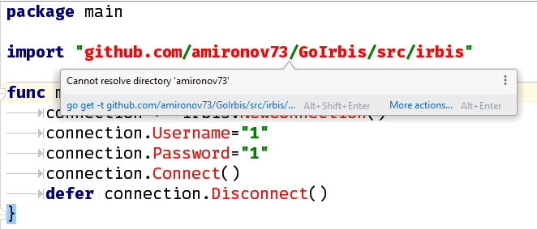

## Пакет irbis

### Введение

Пакет `irbis` представляет собой простую библиотеку для создания клиентских приложений для системы автоматизации библиотек ИРБИС64 на языке Go.

Пакет не содержит ссылок на внешний код и не требует irbis64_client.dll. Успешно работает на 32-битных и 64-битных версиях операционных систем Windows и Linux.

Основные возможности пакета:

* Поиск и расформатирование записей.
* Создание и модификация записей, сохранение записей в базе данных на сервере.
* Работа с поисковым словарем: просмотр терминов и постингов.
* Административные функции: получение списка пользователей, его модификация, передача списка на сервер, создание и удаление баз данных.

Поддерживается компилятор Go, начиная с версии 1.12 (как 32-битные, так и 64-битные версии) и сервер ИРБИС64, начиная с 2014. Более ранние версии инструментария Go будут выдавать ошибки.

### Установка

Возможны два варианта установки пакета. Первый предусматривает копирование папки `irbis` из репозитория в свой проект, после чего используется следующая ссылка на пакет

```go
import "./irbis"
```

Второй вариант -- предпочтительный. Пакет подключается следующим образом:

```
go get github.com/amironov73/GoIrbis/src/irbis
```

а в исходных текстах программы на него ссылаются так:

```go
import "github.com/amironov73/GoIrbis/src/irbis"
```

В среде GoLand скачивание пакета автоматизировано, пользователю остается лишь согласиться с предложением загрузить и установить пакет:



### Примеры программ

Ниже прилагается пример простой программы. Сначала находятся и загружаются 10 первых библиографических записей, в которых автором является А. С. Пушкин. Показано нахождение значения поля с заданным тегом и подполя с заданным кодом. Также показано расформатирование записи в формат `brief`.

```go
package main

import "../src/irbis"

func main ()  {
	// Подключаемся к серверу
	connection := irbis.NewConnection()
	connection.Host = "localhost"
	connection.Username = "librarian"
	connection.Password = "secret"
	if !connection.Connect() {
		println("Не удалось подключиться")
		return
	}

	// По выходу из функции произойдет отключение от сервера
	defer connection.Disconnect()

	// Общие сведения о сервере
	println("Версия сервера:", connection.ServerVersion)
	println("Интервал:", connection.Interval)

	// Из INI-файла можно получить настройки клиента
	ini := connection.IniFile
	dbnnamecat := ini.GetValue("Main", "DBNNAMECAT", "???")
	println("DBNNAMECAT:", dbnnamecat)

	// Находим записи с автором "Пушкин"
	found := connection.Search("\"A=Пушкин$\"")
	println("Найдено:", len(found))

	// Ограничиваемся первыми 10 записями
	found = found[:10]

	for _, mfn := range found {
		// Считываем запись с сервера
		record := connection.ReadRecord(mfn)

		// Получаем значение поля/подполя
		title := record.FSM(200, 'a')
		println("Заглавие:", title)

		// Расформатируем запись на сервере
		description := connection.FormatMfn("@brief", mfn)
		println("Биб. описание:", description)
	}
}
```


[Следующая глава](chapter2.md)
